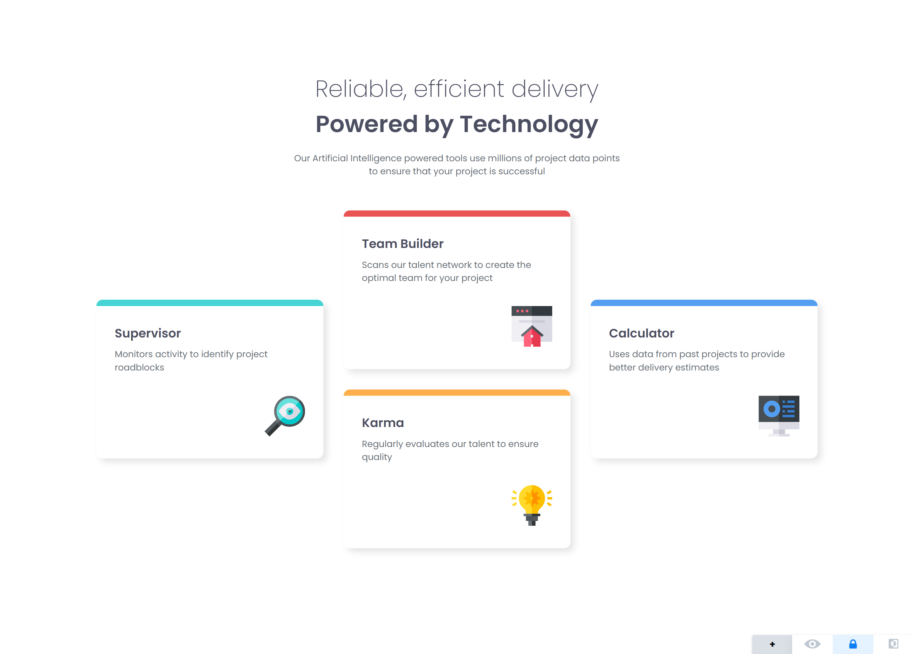

# Frontend Mentor - Four card feature section solution

This is my solution to the [Four card feature section challenge](https://www.frontendmentor.io/challenges/four-card-feature-section-weK1eFYK) on Frontend Mentor. It’s a responsive layout featuring four distinct cards, each representing a core function, using clean HTML and modern CSS techniques.

## 📸 Screenshot

## 🔗 Links

- Live Site: [Your Live Site URL](https://4y0ub-kkkk.github.io/four-card-feauture-section/)
- Solution on Frontend Mentor: [Your Solution URL](https://github.com/4y0ub-kkkk/four-card-feauture-section)

## 🛠️ Built With

- Semantic HTML5 markup
- CSS custom properties (variables)
- CSS Grid
- Flexbox
- Mobile-first workflow
- Google Fonts (Poppins)

## 💡 What I Learned

While working on this challenge, I improved my understanding of:

- **CSS Grid** and how to control layout with `grid-template-areas`
- Using `clamp()` for responsive font sizing
- Creating modular, reusable components
- Writing clean, mobile-first responsive styles

## 📚 Useful Resources

- [CSS Grid Layout – MDN](https://developer.mozilla.org/en-US/docs/Web/CSS/CSS_Grid_Layout) – Comprehensive guide to CSS Grid.
- [Google Fonts](https://fonts.google.com/specimen/Poppins) – Used for styling the typography.

## 🚀 Continued Development

In future projects, I’d like to:

- Refine grid systems for more complex layouts

## 👤 Author

- Frontend Mentor - [@4y0ub-kkkk](https://www.frontendmentor.io/profile/4y0ub-kkkk)
- GitHub - [@4y0ub-kkkk](https://github.com/4y0ub-kkkk)

